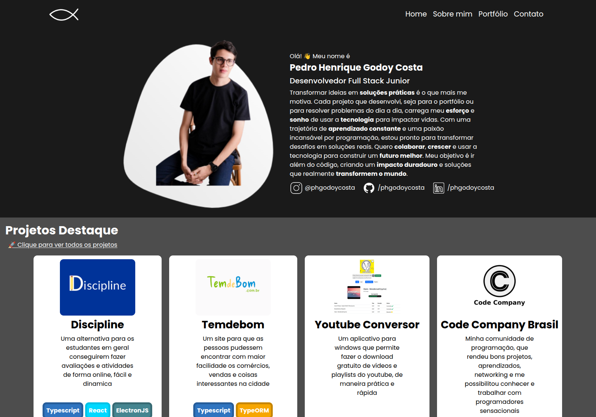

# 👨‍💼 Meu site portfólio


Esse é o meu site porfólio com todas as minhas experiências pessoais, habilidades, 
conhecimentos, projetos trabalhados e um pouco mais sobre mim.

Um espacinho que conta um pouco da história de Pedro Henrique Godoy Costa.

Para saber mais detalhes sobre o projeto, funcionamento, ideia e o processo de desenvolvemento, acesse esse link para ler a **matéria completa** no meu site repositório:

**Link da Matéria Completa:** [https://phgodoycosta.com.br/projeto/site-portfolio](https://phgodoycosta.com.br/projeto/site-portfolio)

### Tela inicial

<div align="center">
    </img>
</div>

## 📦 Instalação

```bash
# Clonar o repositório
git clone https://github.com/PHGodoyCosta/site-portfolio-phgodoycosta
cd site-portfolio-phgodoycosta

# Instalar dependências NPM
npm install
# ou usando pnpm
pnpm install

# Instalar Dependências do Composer
composer install

# Configurar variáveis de ambiente
cp .env.example .env
```

Para rodar você vai precisar iniciar um servidor Vite se quiser alterar os arquivos CSS e JS em desenvolvimento sem precisar de build e com hot reload:

```bash
npm run dev
```

E então em outro terminal iniciar o servidor PHP

```bash
php artisan serve
```

## ⚙️ Configuração

No arquivo `.env` não esqueça de alterar as informações do banco de dados:

```env
DB_CONNECTION=mysql
DB_HOST=127.0.0.1
DB_PORT=3306
DB_DATABASE=laravel
DB_USERNAME=root
DB_PASSWORD=
```
